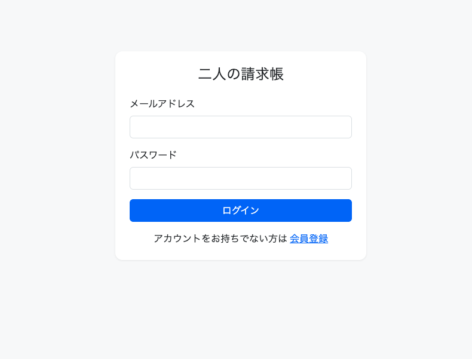
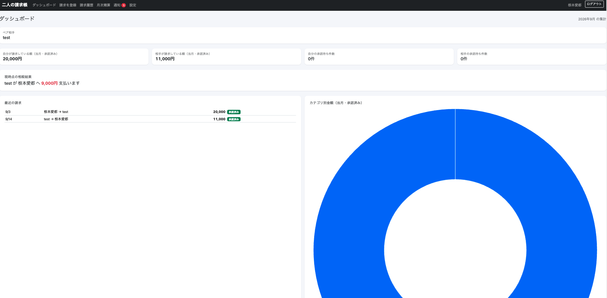
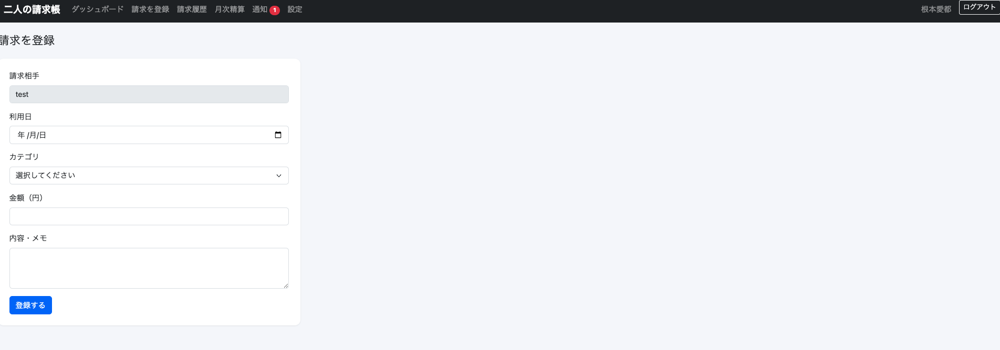
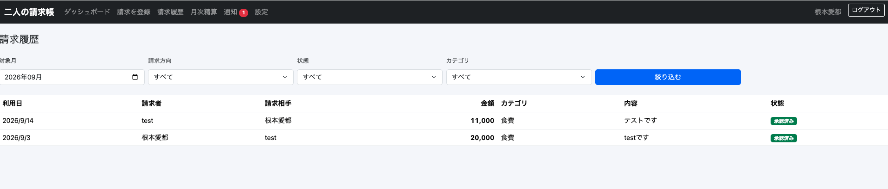
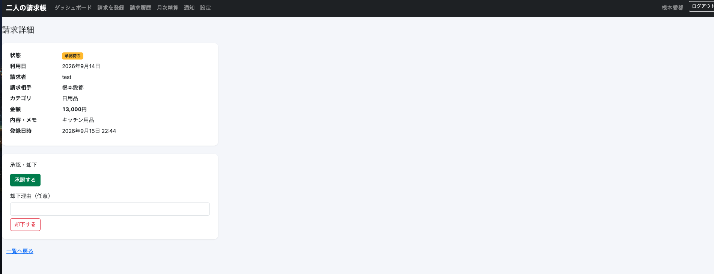
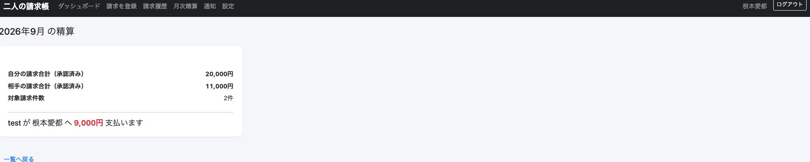
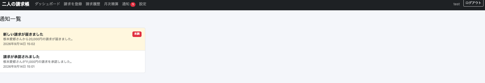

# 二人の請求帳（PairBill） Ruby on Rails版

カップル・夫婦・同居人など2人の間で発生した立替金や請求を登録・承認し、月単位で差額を相殺して精算できるWebアプリケーションです。

[Java（Spring Boot）版](https://github.com/Nemoto-Manato/pairbill)と同じ仕様を、Ruby on Railsで実装し直したものです。同じ要件を異なる言語・フレームワークで実装することで、双方の設計思想の違い（MyBatisの手書きSQL ↔ ActiveRecordのORM など）を学ぶ目的で作成しました。

## 1. 解決する課題

- 口頭やチャットだけで管理すると、誰が何を立て替えたのか分からなくなる。
- 請求内容について、相手が確認したか分からない。
- 双方向の請求を個別に支払うと、送金回数が増える。
- 精算後に過去の請求が変更されると、金額の整合性が崩れる。

## 2. 技術構成

| 分類 | 採用技術 |
|---|---|
| 言語 | Ruby 3.3 |
| フレームワーク | Ruby on Rails 8.1 |
| 画面テンプレート | ERB + Turbo（Hotwire） |
| CSS | Bootstrap 5 + 独自CSS |
| グラフ | Chart.js |
| データベース | MySQL 8.x |
| DBアクセス | Active Record |
| 認証 | has_secure_password（BCryptでハッシュ化） |
| テスト | Minitest |

### アーキテクチャ

Controllerを薄く保ち、業務ロジック（承認・精算・権限確認など）は`app/services`配下のサービスクラスに集約しています。Java版のController/Service/Mapper構成に近い形にしつつ、モデルの永続化そのものはActive Recordに任せています。

```
Controller … HTTPリクエストの受付・入力検証（Active Modelのバリデーション呼び出し）
Service    … 承認、精算、権限確認などの業務ロジック（トランザクション管理を含む）
Model      … Active Recordによる永続化・バリデーション・関連定義
View(ERB)  … 画面表示
```

## 3. 主な機能

- **会員登録・ログイン**：メールアドレス＋パスワード（has_secure_passwordでBCryptハッシュ化）
- **ペア作成・招待**：8文字のランダム招待コード（24時間有効）で2人目を招待。`SELECT ... FOR UPDATE`による行ロックで3人目の同時参加を防止
- **請求登録・履歴・詳細**：利用日、金額（1〜9,999,999円）、カテゴリ、内容を登録。対象月・方向・状態・カテゴリで絞り込み、ページング対応
- **承認・却下**：請求相手のみが操作可能。承認は取消不可（確認ダイアログあり）
- **ダッシュボード**：当月の請求合計・相殺結果・承認待ち件数・最近の請求・カテゴリ別グラフ（Chart.js）
- **月次精算**：承認待ちゼロを条件に申請、相手が承認すると対象月を恒久ロック。申請中は請求の登録・変更を禁止
- **アプリ内通知**：請求登録／承認／却下、精算申請／完了のタイミングで自動作成。未読件数をヘッダーに表示
- **ユーザー設定**：表示名の変更

## 4. 画面キャプチャ

同じ仕様のJava版と画面は共通です。

| ログイン | ダッシュボード |
|---|---|
|  |  |

| 請求登録 | 請求履歴 |
|---|---|
|  |  |

| 請求詳細（承認・却下） | 月次精算確認 |
|---|---|
|  |  |

| 通知一覧 |
|---|
|  |

## 5. セットアップ方法（MAMP + MySQL）

### 前提

- Ruby 3.3（`.ruby-version`参照。rbenvなどのバージョン管理ツールを推奨）
- MAMP（MySQL 8.x が使えること）
- MySQLクライアントライブラリ（`mysql2` gemのビルドに必要。macOSの場合 `brew install mysql-client` など）

### 手順

1. 依存gemをインストールする。

   ```bash
   bundle install
   ```

2. MAMPを起動し、MySQLを立ち上げる。ポート番号は環境設定画面で確認する。

3. データベースを作成し、マイグレーションと初期データ投入を行う（テーブルはActive Recordのマイグレーションが自動で作成するため、SQLファイルを手動で実行する必要はない）。

   ```bash
   export DB_USERNAME=root
   export DB_PASSWORD=（MAMPのMySQLパスワード）
   export DB_PORT=（MAMPのMySQLポート。デフォルトは3306）
   bin/rails db:create db:migrate db:seed
   ```

4. サーバーを起動する。

   ```bash
   bin/rails server
   ```

5. ブラウザで `http://localhost:3000` を開く。

### テストの実行

```bash
export DB_USERNAME=root
export DB_PASSWORD=（MAMPのMySQLパスワード）
export DB_PORT=（MAMPのMySQLポート）
RAILS_ENV=test bin/rails db:schema:load
bin/rails test
```

## 6. Java版との主な違い

| 項目 | Java版 | Ruby版 |
|---|---|---|
| テーブル作成 | `sql/schema.sql`を手動実行 | `rails db:migrate`が自動実行 |
| パスワードカラム | `password_hash` | `password_digest`（has_secure_passwordの規約） |
| 状態変更の検証 | Bean ValidationでPOSTのみ許可 | RESTfulルーティング（PATCH/DELETEを使用） |
| ステータス値 | Javaのenum | Active Recordの`enum`（文字列カラムにマッピング） |

## 7. 工夫した点

- **不正な閲覧・更新の防止を最優先に設計**：Controllerのbefore_actionだけでなく、Service層でも所有者・ペアメンバーシップ・請求/精算の状態を必ず検証しています。
- **同時実行に対する排他制御**：招待コードによるペア参加と精算申請は`Pair.lock.find`（`SELECT ... FOR UPDATE`）でペア行をロックし、2人を超える同時参加や二重精算申請を防止しています。
- **精算のスナップショット化**：精算申請時点の請求合計・差額をDBへスナップショット保存し、精算完了後はその値のみを表示する設計にしています。
- **実際のMySQLに対するエンドツーエンドの動作確認**：Minitestによる単体テストに加えて、実際にMySQLを起動し、会員登録からログイン・ペア作成・招待・請求登録・承認・ダッシュボード集計・精算申請・承認・ロック・通知まで一連の操作をHTTPリクエストで再現して検証しました。この過程でjson gemのバージョン不整合によるセッション処理の不具合を発見し、修正しています。

## 8. ディレクトリ構成（抜粋）

```
app/controllers/  画面・APIの入口
app/services/     業務ロジック（トランザクション管理を含む）
app/models/       Active Recordモデル（関連・バリデーション）
app/views/        ERBテンプレート
app/errors/       共通例外クラス
db/migrate/       マイグレーション（テーブル定義）
db/seeds.rb       カテゴリの初期データ
```

## 9. MVP対象外（将来拡張）

承認後の取消申請、精算完了後の取消、レシート画像アップロード、メール／LINE／プッシュ通知、ペア解除・退会、3人以上のグループ、CSV/PDF出力などはMVPの対象外としています。
